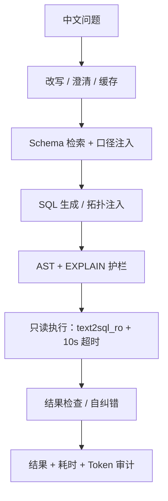

# Text2SQL Agent

**当前代码验证（2026-11-18上午）**：p15系统提示保留；指标除零/时间模板边界候选集中验证Java944/944，原200题仅16题指标文本变化，系统/表列/示例不变，供应商调用0/费用¥0。正式准确率仍85.33%未达89%，不能把局部验证当整体通过。详见[设计与验收边界](docs/SEMANTIC_CONSISTENCY_MATRIX_20261117.md#指标除零保护与时间模板作用范围2026-11-18)；下文数字保留各测量版本。

**当前默认（2026-11-18早）**：p16开发对照69→68/100、深层多表5→3/10，候选否决，默认已精确恢复p15；回退后单次Java861/861。未追加正式三轮，最新正式准确率仍85.33%未通过；开发集不是新验收分数。详见[结果与设计导读](docs/SEMANTIC_CONSISTENCY_MATRIX_20261117.md#p15p16开发对照结果拒绝p16恢复p15默认)。

**当前阶段2状态（2026-11-18归档）**：[最新回归与卡点](docs/STAGE2_REGRESSION_RESULTS_20261117.md)：p15三轮84/84/88，平均85.33%＜89%门槛，未通过；SQL成功93%与模型正确率分开统计。Java最终报告859/859（完整一次+失败项补验）、Gold200/200；原题库仍200题，300是三轮请求数。295模型调用、费用下界≥¥0.59132004、15次用量未知，调用时段核对通过。阶段4本机验收是此前版本的已归档结果，不能替代本次语义回归或全项目验收；阶段3P95继续暂缓。

**最新阶段4结果（2026-11-17晚）**：[完整真实验收报告](docs/DEMO_HTTP_RESULTS_20261117.md)：本机范围阶段4原五项门槛通过；固定20条接口19/20、严格结果匹配16/20（80%）、健康及会话完整性通过，平均3.198秒/P95 11.030秒，22调用/53,715 Token、完整配置估价¥0.03923214。隔离环境首次真实问数1/1、2.393秒/2,295 Token、估价¥0.0008454，独立报告。起跑工具时间序列化失败发生在问数前、0模型调用，旧现场保留；实际20条仅运行一次，题/Gold/评分器未变。阶段2语义契约、独立盲测和整体项目仍未完成，阶段3P95继续暂缓。下列“待运行/未通过”保留历史时点，以本报告及验收矩阵为准。

**当前构建保护复验（2026-11-17）**：[入口认证/限流与费用HTTP](docs/PROTECTED_CURRENT_ACCEPTANCE_20261117.md)在冷构建同版业务类上通过36/36项、4/4组；合成模型5次、供应商0次/费用0，5进程与5端口退出。补足旧版本HTTP证据，未替代待运行的真实20条与隔离环境问数。

**当前验收清单**：[阶段4验收矩阵与剩余路径](docs/STAGE4_ACCEPTANCE_MATRIX_20261117.md)。10份已有证据的离线审计通过，本轮模型0次/费用0；新20条真实HTTP与干净环境统一链路仍待验收，阶段3 P95继续暂缓。下列报告中的测试数量与“下一步”保留各历史时点，不能当作当前统一状态。

**隔离环境补验（2026-11-17）**：[新包＋公开模板＋新数据库的同机链路](docs/ISOLATED_CHAIN_ACCEPTANCE_20261117.md)已完成健康/无Key503、5个具名只读连接、Gold200/200；供应商0次/费用0。新容器已停止、卷保留，原库保持运行；同一环境的一次真实问数已冻结，待空闲时段首次执行。

**最新阶段4补验（2026-11-17）**：[同机空Maven缓存与新JAR验收](docs/COLD_BUILD_ACCEPTANCE_20261117.md)：起始缓存0文件、185JAR/347POM校验、后续离线verify退出0且Java710/710、无Key实际HTTP8/8、Gold200/200，模型0次/费用0。首轮PowerShell包装脚本异常与未知Maven退出码保留，不冒充新操作系统验收。[新20条协议](docs/DEMO_HTTP_PROTOCOL_20261117.md)已冻结并绑定该新包，仍待空闲时段真实运行；[DeepSeek高峰门禁](docs/OFFPEAK_EVALUATION_20261117.md)逐次保护生成/纠错/改写，阶段3 P95继续暂缓，阶段4及整体验收未完成。下列记录保留各历史交付时点。

**最新阶段4交付（2026-11-17）**：[复购率澄清证据规则](docs/REPURCHASE_CLARIFICATION_20261117.md)修复明确分母仍被反问的问题，保留裸词、分子/过滤条件和不确定表达的澄清。Java670/670、真实HTTP链路8/8，外部模型0次/费用0；原200题仅T6-003解除误拦截，不能当作新准确率。此前[类目NULL定点补验](docs/CATEGORY_NULL_CONTRACT_20261117.md)3/3、[持久化费用预留](docs/COST_QUOTA_20261117.md)已完成。完整20条真实模型复验待接续，旧85%与P95欠项保留，阶段4和整体项目仍未通过。

**当前执行状态（2026-11-16）**：按用户决定暂缓阶段3 P95 优化，继续改进方案阶段4的本机受控演示。阶段3总预算、有界调用与计时机制已实现，但原定三轮平均 P95 <8秒仍未通过，完整成本存在未知项；不降低原门槛、不推广已被否决的加速候选。独立盲测、完整语义契约及整体验收仍未完成。下文逐轮记录保留当时状态，当前执行顺序以本段及[阶段调整](docs/STAGE3_DEFERRAL_20261116.md)为准。

**阶段4当前补验（2026-11-17）**：[持久化费用预留](docs/COST_QUOTA_20261117.md)已在protected模式启用：默认总额1元、每次调用先预留0.10元，未知用量继续占用、重启不清零。Java625/625、独立进程费用HTTP 4/4组、认证HTTP回归36/36，外部调用0/费用0；这是配置估价准入，不能承诺供应商账单硬封顶。普通demo/baseline默认不开启。阶段3 P95仍暂缓，NULL语义、澄清误报与整体验收仍有欠项；下列“费用配额尚未实现”描述之前认证交付时点。

**阶段4类目NULL口径**：[契约与补验](docs/CATEGORY_NULL_CONTRACT_20261117.md)已定义分组默认排除NULL、用户明确要求时保留；不自动改SQL/删响应行。Java640/640，真实数据库反例8/8；原200题检索/列/示例/系统消息不变，15题增加政策。冻结3条真实HTTP补验3/3，3次模型调用、7,772 Token、配置估价¥0.00584928、未知0。仅为定点修复，不覆盖旧20条85%或产生新盲测/P95结论；澄清误报仍待处理。

**本机运行入口**：[受控演示与验收步骤](docs/LOCAL_DEMO.md)。`scripts/start_local.ps1 -Mode demo` 与 `-Mode baseline` 固定监听本机；`/api/health` 显示实际能力开关和预算，配置就绪不代表供应商调用已验证。[首项交付验收](docs/LOCAL_DEMO_ACCEPTANCE_20261116.md)：Java547/547、Gold200/200、真实HTTP问数1条匹配，估价¥0.0006094。阶段4尚未整体验收。

**阶段4连续HTTP验收**：[固定20条结果](docs/DEMO_HTTP_RESULTS_20261116.md)，测量`452209b`：接口18/20、结果正确17/20，20次后续健康正常；平均3.217秒、HTTP P95 10.083秒，21次模型调用、1次未知用量，费用仅已知下界≥¥0.03040434。交错追问2/2正确，但超时会话少记一轮，完整验收未通过。该轮Java555/555，原题库仍200题，无新泛化准确率结论。

**阶段4超时会话修复补验**：[设计与证据](docs/SESSION_OUTCOME_FIX_20261116.md)，生产修复`b2447bc`，Java全量566/566。真实本机HTTP+PostgreSQL补验3/3：生成超时504与纠错超时保留首答均15.009秒返回，历史各1轮；释放晚到模型并等待工作线程退出后无重复写入，其他会话不变。4次本地模型替身调用，外部调用0、费用¥0；不产生新准确率或生产P95结论，旧20条结果与失败保留。隔离新数据库复现随后已完成，见下条；阶段4尚未整体验收。

**阶段4新数据库复现**：[完整路径与结果](docs/CLEAN_DEMO_ACCEPTANCE_20261116.md)。同一主机新建独立容器/卷，37张业务表＋4张持久化表、2,616,948行；两账号业务表可写数均0、4/4实际防写探针被拒绝。原200题Gold自检200/200（模型0次），真实HTTP问数1/1匹配54,011，1.418秒、2,228 Token、估价¥0.0005774、未知0。隔离容器已停止并保留卷，原库继续运行；未验证全新主机/空Maven缓存。下一项是访问控制/限流与费用上限，语义NULL和澄清误报仍待独立处理，阶段4未整体验收。

**阶段4入口保护**：[单用户认证与限流](docs/ACCESS_CONTROL_20261117.md)新增protected模式，所有页面/接口统一认证，API共享突发10、每分钟30、并发2的限制。Java605/605（新增39项）、真实HTTP36/36，外部模型调用0/费用0；原demo/baseline未自动启用认证。费用配额尚未实现，阶段4尚未整体验收，不恢复阶段3P95实验。

最新阶段3观测修复：[中断请求分段计时](docs/BUDGET_TIMINGS_FIX_20261116.md)：统一预算开启路径的请求分段时钟，15秒受控模型阻塞记录检索37ms、生成14973ms、总计15011ms；纠错超时保留首答但计入整次等待。Java535/535（新增9项）、Python96/96，真实PostgreSQL取消与本地慢HTTP检查无跳过，外部供应商调用0、费用0。未更新模型准确率或生产P95，阶段3仍未通过。实现`966df68`上补验Gold200/200、模型调用0，默认/候选各100条完整提示词与前轮不变。

最新阶段3开发筛选：[参考示例表依赖过滤结果](docs/AVAILABLE_EXAMPLES_RESULTS_20261116.md)，测量`15a2e93`：原dev100×2策略=200次请求、192次模型调用，默认69/100、候选68/100；P95 11.423→15.002秒（+31.33%），超时3→6、完整费用未确认，候选拒绝、不追加600次。Gold200/200、实际192条首答配对及账目审计通过；沿用实现冻结前Java526/526、离线审计96/96。生产默认不变，阶段3仍未通过。新发现超时请求generationMs记0但budget.stage=MODEL，下一步修复分段耗时归因，不改评测题或Gold。

最新阶段3诊断：[简单路由与叶子表裁剪的离线可行性](docs/LATENCY_FEASIBILITY_20261116.md)：三份历史dev100即使把54道单表/时间题压到零耗时，P95仍11.198/13.690/15.004秒，不实现仅简单题加速路由。离线叶子裁剪表全召回保持96/100，用户消息缩短5.40%，对应历史慢题仅缩短1.15%–2.68%；59题参考示例依赖超出当前Schema，作为下一项输入一致性实验依据。新增模型调用0、费用0，不修改生产默认、不报新准确率/P95；审计84/84、test-compile通过，阶段3仍未通过。

最新生产修复：[会员订单占比定义与缓存隔离](docs/MEMBER_PENETRATION_FIX_20261116.md)：分子改为会员订单数，LEFT JOIN保留非会员分母，空分母返回NULL；指标资源SHA-256进入缓存键与观测。Java511/511、数据库契约24/24、两种上下文实际注入8/8、离线审计74/74、Gold自检200/200。真实库98,207笔有效订单均匹配会员，100%结果存在样本盲区，另用非会员反例验收。本轮真实模型调用0，不更新准确率/P95，阶段3仍未通过。


最新真实开发筛选：[仅移除四步指令](docs/PROMPT_DIRECTIVE_RESULTS_20261116.md)，测量`466f223`：原dev100×2配置=200次请求，默认69/100、候选64/100，P95 15.004/9.154秒。准确率退步5pp、候选1次未知用量，拒绝晋级，不追加600次；生产默认保留。另确认会员渗透率指标字典人数/订单定义冲突，发现时已记录待修复；现已完成上述生产修复，未改Gold。

阶段3新增[显式指令实验入口](docs/EXPLICIT_REASONING_VARIANT_20261116.md)：默认Prompt字节保持一致，候选只删259单位；Java484/484、离线审计62/62。仅完成实现与离线验证，新增模型调用0次；专用筛选协议与配对审计待完成，尚未真实评测或推广。

最新离线诊断：[提示词组成与验收](docs/PROMPT_COMPOSITION_20261116.md)：原dev100＋eval100，600次本地重复比较无漂移、194/194条真实首答指纹对齐；系统消息占文本约55%，显式四步推理指令仅占约5%。模型调用0次、费用0元；文本单位不是Token，不宣称加速或准确率提升，阶段3仍未通过。

> 中文业务问题 → 只读 PostgreSQL SQL → 结构化结果。基于 Olist 37 表电商数仓，面向“可评估、可解释、可归因”的 Text2SQL Agent。


**历史生成模式确认：默认 91.00% / 关闭思考 87.33%** · **最近 Java 全量 670/670** · **53/53 对抗回归** · **整体项目尚未通过验收**

题库规模：原基准 **200道（dev100＋eval100）**，另有候选集100道。下文“600次问答”是同一批100道eval题 × 2种配置 × 3轮，不是新增600道题；输出Token筛选另用原100道dev题 × 2种配置，共200次问答。

最新开发筛选：[low思考强度结果](docs/LOW_REASONING_RESULTS_20261116.md)，测量代码`3797a47`：同dev100×2模式=200次请求，默认69/100、low67/100，P95 15.001/7.609秒。low仍有1次超时用量未知，完整费用未确认，按协议不进入正式三轮确认；不额外跑600次，生产默认未改，阶段3仍未过。Gold200/200、离线审计62/62，Java业务代码未变，沿用459/459证据。

最新正式确认：[生成模式三轮结果](docs/GENERATION_MODE_MATRIX_RESULTS_20261116.md)，测量代码`1e3a11f`：原eval100×2模式×3轮=600次请求。默认91/90/92（均值91.00%），none87/88/87（87.33%）；平均P95 11.799/1.474秒。none准确率退步3.67pp且低于原冻结90%下限，**候选否决，阶段3未过**。none费用每轮≤¥0.104、未知0；Java459/459、审计57/57、Gold200/200，生产默认未改。

此前生成模式开发筛选：[结果与导读](docs/GENERATION_MODE_RESULTS_20261116.md)，测量代码`ed52a67`：同100道dev题×2模式=200次请求，默认65/100、none64/100；P95 11.198/1.733秒，none完整估价¥0.09702184、未知0，允许三轮确认。复杂层仍有退步；Java459/459、审计46/46、Gold200/200；生产默认不变，阶段3未通过。

最新开发筛选：[输出Token预算实验](docs/OUTPUT_BUDGET_RESULTS_20261116.md)，同100道dev题各跑一次，共200次问答：8192组68/100、2048组66/100，P95为15.002/13.078秒。候选出现6题明确截断、3次未知用量，未采用；生产默认未改，阶段3仍未通过。Gold200/200、离线审计40/40，Java业务源码沿用上一轮436/436证据。

前一专项：[请求总预算三轮对照](docs/REQUEST_BUDGET_RESULTS_20261116.md)，测量代码`a1730e0`，600次问答。开启组平均P95 **11.842秒**，仍未达8秒；最慢15.013秒，5次调用用量未知，费用仅有已知下界。Gold200/200、Java436/436、离线审计30/30，阶段3未通过。[子agent内部审核](docs/HOLDOUT_INTERNAL_REVIEW_20261116.md)覆盖候选集100题，发现1项确定Gold缺陷、6题业务待确认、12题弱证据；保持原题和原分数，不宣称独立盲测。

候选集历史基线：[2026-11-16 冻结候选集首轮基线](docs/HOLDOUT_RESULTS_20261116.md)，测量代码 `219f5c4`，开发集66/100、候选集87/100，P95为10.316/7.529秒，估算费用¥0.265/0.277。候选集为AI编写、未经独立审核，每组仅一轮，不能将两套题的分差解释为过拟合或与旧eval分数直接比较；独立盲测尚未完成。

前置 [SQL 提取边界修复](docs/SQL_EXTRACTION_20261116.md)已通过63/63边界契约和1,184条归档SQL回放，本轮基线已包含修复。此前[四配置 × 三轮评测](docs/ABLATION_RESULTS_20261116.md)共1,200次问答，基线92.00%/完整检查组90.33%，仍绑定旧测量代码 `3828e77` 和旧eval集合。历史96/100不能作为当前稳定准确率。

[快速开始](#快速开始) · [基准结果](#基准结果) · [评测方法](#评测方法) · [已知局限](#已知局限) · [设计文档](#设计文档)


*实机运行：嵌入电商供应链中台的 Text2SQL 智能分析工作台（以 2018 年品类销售额 TOP 5 问数为例），展示 AST 安全校验、数仓耗时与多维数据渲染。*

## 这是什么 / 不是什么

- **是**：把中文业务问题翻译成只读 PostgreSQL SQL 的 Agent，带 Schema 检索、Join 拓扑、AST 校验、EXPLAIN 护栏、8 条启发式结果检查和结果集评测。
- **不是**：不是生产级多租户 BI；不支持写操作、多 SQL 方言、模型微调；当前单租户、无 RLS；P95 未达 8s。

## 核心特性

- **Schema 检索与 Join 拓扑**：领域词典最大匹配、外键图上的斯坦纳树近似规划与Top-8上下文。最新dev/候选集表全召回92%/96%，dev中4条检索前澄清不能算作算法漏召回；候选集4条实际漏表均最终答错，但不能推断补表必然恢复。旧eval关闭澄清组三轮表全召回99%，属于不同集合。
- **业务口径注入**：`metrics.yml` 保存自定义指标定义，Prompt v9 注入口径与输出列约定；完整列/单位契约尚未建立，不宣称符合外部工业标准。
- **三层只读护栏**：JSqlParser AST（含 CTE 数据修改 / FROM 表函数检查）→ 只读账号 `text2sql_ro` → 10s 超时 + 200 行上限；53 条对抗回归全绿。
- **成本与缓存**：L1 LRU + L2 PostgreSQL的SQL缓存（归一化精确匹配+配置指纹）；最新dev/候选基线关闭应用查询缓存，100题估算 **¥0.265/0.277**，包含未采用的重试，不等于供应商账单。旧eval四组三轮均值为¥0.208–0.218/100题。
- **多轮对话与 Web UI**：指代消解、Schema 复用、会话落库；启动后打开 `http://localhost:8080` 即可问数。

## 系统架构

系统采用手工编排管道（Pipeline），每一步都有分阶段耗时与 token 审计：


```mermaid
flowchart TD
    Q["中文问题"] --> R["改写 / 澄清 / 缓存"]
    R --> S["Schema 检索 + 口径注入"]
    S --> G["SQL 生成 / 拓扑注入"]
    G --> V["AST + EXPLAIN 护栏"]
    V --> X["只读执行：text2sql_ro + 10s 超时"]
    X --> K["结果检查 / 自纠错"]
    K --> O["结果 + 耗时 + Token 审计"]
```

## 基准结果

最新单轮dev/候选集与逐次重试证据见[冻结候选基线](docs/HOLDOUT_RESULTS_20261116.md)：dev 66/100，候选集87/100。本轮观察到结果规则1次误触发，额外调用后仍保留正确首答；5次其他校验拒绝重试中仅1次最终匹配Gold。以下四配置三轮表属于旧eval集合，仍保留原始口径。

200 条六层评测集，eval 100 条；基于 `deepseek-flash` / `p9-mdl-alignment-v9` / Benchmark v2。2026-11-16 同一代码与数据版本，每配置三轮独立运行：

| 配置 | 三轮正确数（每轮 100 题） | 准确率均值 | 三轮 P95 均值 | 每 100 题平均估算成本 |
|---|---|---:|---:|---:|
| 基线：澄清开，纠错/结果检查关 | 93 / 90 / 93 | 92.00% | 10.153s | ¥0.207652 |
| 仅增加自纠错 | 94 / 93 / 95 | 94.00% | 10.393s | ¥0.209805 |
| 澄清 + 自纠错 + 结果检查 | 93 / 92 / 86 | 90.33% | 10.821s | ¥0.217553 |
| 澄清/纠错/结果检查均关 | 95 / 93 / 91 | 93.00% | 10.548s | ¥0.213380 |

该旧矩阵中，仅自纠错组实际重试0次，不能把高出的2分归为纠错收益。完整检查组实际恢复2次、退化0次，触发源均为校验拒绝，结果合理性检查触发0次；其较低均分不能证明检查器损害准确率。P95是每轮服务调用墙钟分位数的均值，不含HTTP与事后评分。详细波动、分层、逐题证据及局限见[四配置三轮归档](docs/ABLATION_RESULTS_20261116.md)。

以下保留历史结果，配置、代码和部分基准口径不同，不用于机制因果比较：

| 维度 | 2026-11-09 单轮快照（清洗后 v2） | 清洗前基准（实验四，非盲测） | 历史主口径（三轮归档） |
|---|---|---|---|
| **执行准确率** | **96.00% (96/100)** | **88.00% (88/100)** | 84 / 85 / 86 |
| **SQL 有效执行率** | **100.00%** | 100.00% | 100% |
| T1 / T2 / T3 | **100% / 95.00% / 100%** | 100% / 95.00% / 93.75% | 100% / 80–85% / 81.25–87.5% |
| T4 / T5 / T6 | **95.45% / 90.00% / 91.67%** | 90.91% / 30.00% / 91.67% | 81.82–86.36% / 40–60% / 91.67–100% |
| 按表数：1 表 / 2 表 | **96.61% / 94.44%** | 96.61% / 88.89% | 96.61% / 83–88% |
| 按表数：3 表 / 4+ 表 | **100.00% / 90.91%** | 81.82% / 50.00% | 72–81% / 41–50% |
| 表全召回 / 平均召回 / 精确率 | **99.00% / 99.80% / 约 28%** | 98.00% / 99.55% / 约 28% | 98.00% / 99.55% / 约 28% |
| Prompt Token | **2107** | 2131 | 1967 / 1971 / 1994 |
| 100 题推理成本 | **¥0.223 / 100 题**（单题 ¥0.00223） | ¥0.294 / 100 题 | ¥0.221 / 100 题 |
| P50 / P95 延迟 | **2.00s / 12.81s**（目标 <8s，未达标） | 1.98s / 14.31s | 1.89s / 12.06–17.27s |
| 测试 / 安全护栏 | **292 项全通过 / 53 条对抗 100% 拦截** | 279 全绿 / 53 条对抗 | 280 全绿 / 53 条对抗 |
| dry-run 自检 | **200/200 (100%)** | 200/200 (100%) | 200/200 (100%) |

> 历史明细：[2026-11-09 的 96% 单轮报告 (v2)](reports/eval-20261109-181803.json) · [清洗前 88% 报告](reports/eval-20261109-175426.json) · [历史基准 1](reports/eval-20261108-210214.json) · [历史基准 2](reports/eval-20261108-212550.json) · [历史基准 3](reports/eval-20261108-221405.json)。基准清洗说明与成本公式详见 [docs/EVALUATION.md](docs/EVALUATION.md)。

## 快速开始

### 1. 环境

Java 21、Maven 3.9、Docker、Python 3.10（数据脚本）。

### 2. 数据库

```powershell
docker compose -f docker/docker-compose.yml up -d
powershell -File scripts/rebuild_db.ps1
```

```bash
docker compose -f docker/docker-compose.yml up -d
for f in 01_olist_schema 02_load_olist 03_extend_schema 04_seed_extend 05_readonly_role 06_persistence; do
  docker exec text2sql-postgres psql -U text2sql -d olist -q -v ON_ERROR_STOP=1 -f "/data/schema/${f}.sql"
done
```

数据库默认 `localhost:5432/olist`；CSV 通过 Docker 只读挂载，不进仓库。

### 3. 配置与启动

```bash
cp src/main/resources/application-local.example.yml src/main/resources/application-local.yml
```

```powershell
$env:AGENT_LLM_API_KEY = "sk-xxxxxxxx"
powershell -ExecutionPolicy Bypass -File scripts/start_local.ps1 -Mode demo
```

推荐只通过环境变量 `AGENT_LLM_API_KEY` 配置 Key。启动脚本也会读取当前用户永久环境变量，不把 Key 放进命令行或打印出来。没配 Key 可启动；无请求自带 Key 时 `/api/ask` 返回 `503 NOT_CONFIGURED`。本机基线使用 `-Mode baseline`，离线 Gold 自检使用下面的 `-DryRun`，真实评测沿用 `run_eval.ps1`；这些配置的成绩不能混用。健康接口不会付费验证 Key 有效性。

### 4. API

```powershell
$body = @{ question = "2018 年销售额最高的 5 个州是哪些？" } | ConvertTo-Json
Invoke-RestMethod -Method Post -Uri http://localhost:8080/api/ask `
    -ContentType "application/json; charset=utf-8" -Body $body
```

```json
{
  "status": "SUCCESS",
  "sql": "SELECT ... LIMIT 5;",
  "rowCount": 5,
  "retrievedTables": ["orders", "customers", "order_items"],
  "timings": {"retrievalMs": 12, "generationMs": 1150, "validationMs": 4, "executionMs": 18},
  "llm": {"model": "deepseek-chat", "promptTokens": 760, "completionTokens": 95}
}
```

### 5. 测试与评估

```bash
mvn test   # 实际通过数以本次运行末尾 Tests run 为准；含 53 条对抗回归
```

```powershell
powershell -ExecutionPolicy Bypass -File scripts/run_eval.ps1 -Split eval
powershell -ExecutionPolicy Bypass -File scripts/run_eval.ps1 -Split all -DryRun
```

```bash
bash scripts/run_eval.sh eval
DRY_RUN=true bash scripts/run_eval.sh all
```

`-DryRun` 不调模型，只跑 gold SQL 自检；真实 eval 需要 `AGENT_LLM_API_KEY`。

## 评测方法

- **评估集**：200 条六层难度，按 `Math.floorMod(id.hashCode(), 2)` 切 dev/eval 各 100；few-shot 只从 dev 取。
- **执行准确率**：gold SQL 与生成 SQL 都执行，`ResultNormalizer` 规范化后比较结果集；不是字符串匹配，也不是 LLM 裁判。
- **配置绑定**：报告 meta 记录模型、prompt 版本、检索开关、self-correction；数字离开配置没有意义。
- **dry-run**：把 gold SQL 当模型输出跑下游，证明评估器/校验器/执行器自身没坏；本轮 200/200。

## 技术栈

| 模块 | 选型 |
|---|---|
| 语言 / 框架 | Java 21 / Spring Boot 3.5.16 |
| LLM 接入 | Spring AI 1.1.8（OpenAI 兼容，手工装配） |
| SQL 解析 | JSqlParser 5.4 |
| 数据库 | PostgreSQL 16 |
| 编排 | 手工 Pipeline（非框架黑盒） |

## 仓库结构

```
src/main/java        # 接入 / 编排 / 检索 / 生成 / 校验 / 执行 / 缓存 / 会话
src/main/resources   # 配置、glossary / metrics / few-shot、前端
src/test/java        # 单元、集成、对抗回归；通过数见最近验收报告
data/schema          # DDL + 只读/读写角色
data/eval            # 200 条评估集
docs/                # ROADMAP / EVALUATION / FAILURE_ATTRIBUTION ...
reports/             # 多轮对照证据、历史评测、token + cost
scripts/             # 重建库、评估、成本
docker/              # PostgreSQL 容器
```

## 已知局限

| 限制 | 现状 |
|---|---|
| P95 延迟 | 四组的三轮 P95 均值 **10.153–10.821s**（目标 <8s，**未达标**）；生成占调用墙钟总和约 98%，请求总时间预算尚未完成 |
| 检索精确率 | 约 **27–28%**；Top-8 仍引入噪声表，存在 T5-007 漏表，不能用高平均召回掩盖单题缺口 |
| 多租户 / 权限 | 单租户、只读账号 `text2sql_ro`、无 RLS（行级安全隔离），不可直接外网裸露 |
| 跨业务域泛化 | 评估集聚焦于 Olist 电商场景，不宣称无需配置语义字典即可跨业务域开箱即用 |
| Agent 交互模式 | 默认 Pipeline 编排；当前四组对照关闭工具调用，不能凭本轮实验宣称 ReAct 的净收益或固定成本倍数 |
| 泛化与归因 | 当前 eval 已反复用于调优，独立盲测未完成；执行成功但结果不匹配的细分语义归因仍需人工分析 |

## 设计文档

| 文档 | 回答的问题 |
|---|---|
| [ROADMAP.md](docs/ROADMAP.md) | 做什么、不做什么、每阶段验收与取舍 |
| [IMPROVEMENT_PLAN.md](docs/IMPROVEMENT_PLAN.md) | 当前短板、分阶段改进方案与可量化验收路径 |
| [EVALUATION.md](docs/EVALUATION.md) | 消融、指标口径、历史报告、成本公式 |
| [ABLATION_RESULTS_20261116.md](docs/ABLATION_RESULTS_20261116.md) | 1,200 次真实问答、实际重试收益、延迟缺口与原始证据 |
| [SQL_EXTRACTION_20261116.md](docs/SQL_EXTRACTION_20261116.md) | SQL 输出包装修复、正文保留、安全边界与离线验收 |
| [FAILURE_ATTRIBUTION.md](docs/FAILURE_ATTRIBUTION.md) | 三次 15+14+16 条失败分别错在哪一层 |
| [DEFECT_LOG.md](docs/DEFECT_LOG.md) | 缺陷、安全绕过与修法 |
| [SECURITY.md](SECURITY.md) | 安全边界与漏洞报告方式 |

> 数据来源：Olist Brazilian E-Commerce Public Dataset；原始 CSV 不入库，见 [data/raw/README.md](data/raw/README.md)。

---

MIT License · 个人项目，欢迎 Issue / PR；提交前看 [CONTRIBUTING.md](CONTRIBUTING.md)。
